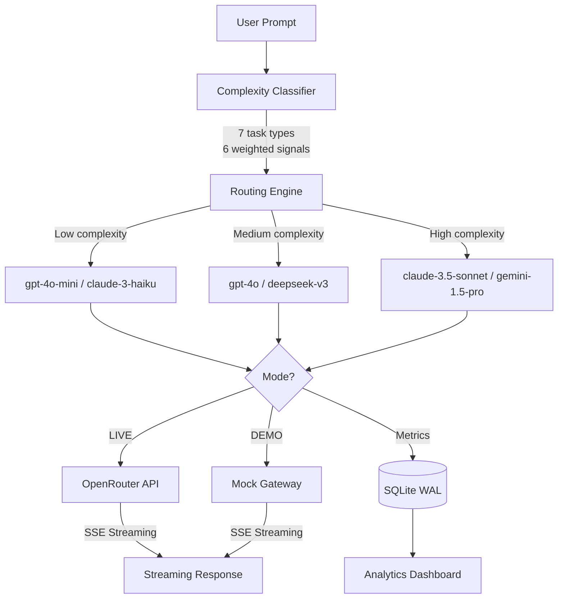

# Intelligent LLM Router

A production-grade system that classifies prompts by complexity, routes them to the optimal LLM, and provides real-time analytics with A/B testing. Supports real LLM calls via OpenRouter (LIVE mode) or runs fully offline with mocked responses (DEMO mode).

## Demo

https://github.com/user-attachments/assets/d7f04cf1-bf53-43f7-a5b3-d63a23f457cd

## Architecture



## Features

- **Smart Routing** — Rule-based classifier analyzes 6 signals (token length, reasoning depth, domain specificity, vocabulary complexity, context needs, task type) to score complexity 1-10 and route to the cheapest capable model
- **7 Task Types** — Code, Creative, Math, Summarization, Translation, Q&A, Multi-step
- **6 LLM Models** — claude-3.5-sonnet, gpt-4o, gemini-1.5-pro, deepseek-v3, gpt-4o-mini, claude-3-haiku
- **LIVE / DEMO Mode** — Set an OpenRouter API key for real LLM calls; runs fully offline with mocks when no key is present. $2/day spend cap auto-switches to DEMO when hit
- **Streaming Responses** — Word-by-word SSE streaming (real tokens in LIVE, simulated in DEMO)
- **A/B Testing Arena** — Stream prompts against 2-3 models in parallel with real-time side-by-side output, then vote for the best
- **Analytics Dashboard** — Request timeseries, model distribution, cost comparison, latency tracking
- **~40% Cost Savings** — Demonstrated through 223 seeded requests over 7 days
- **Retry Logic** — Automatic fallback to next-best model on simulated failures (5% rate)

## Quick Start

### Prerequisites

- Python 3.12+
- Node.js 20+

### One Command

```bash
./start.sh
```

### Manual Setup

**Backend:**

```bash
cd backend
pip install -r requirements.txt
uvicorn main:app --reload --port 8000
```

**Frontend:**

```bash
cd frontend
npm install
npm run dev
```

### Docker

```bash
docker compose up
```

Open http://localhost:5173

### LIVE Mode (optional)

Create `backend/.env` with an [OpenRouter](https://openrouter.ai/) API key:

```
OPENROUTER_API_KEY=sk-or-v1-...
```

The app auto-detects the key on startup and switches to LIVE mode (green badge in the UI). Without a key, it runs in DEMO mode with mocked responses — no external calls needed.

## API Endpoints

| Method | Path | Purpose |
|--------|------|---------|
| POST | `/api/classify` | Classify prompt (no completion) |
| POST | `/api/completion` | Route + stream completion |
| POST | `/api/ab-test` | Run parallel A/B test |
| POST | `/api/ab-test/{id}/vote` | Record winner vote |
| GET | `/api/analytics/summary` | Aggregate stats |
| GET | `/api/analytics/timeseries` | Time-bucketed data |
| GET | `/api/analytics/model-distribution` | Model usage % |
| GET | `/api/analytics/cost-comparison` | Actual vs hypothetical costs |
| GET | `/api/analytics/recent` | Recent requests |
| GET | `/api/mode` | Current mode (live/demo) + spend info |
| GET | `/api/ab-tests/history` | A/B test history |

## Routing Matrix

| Task Type | Low (1-3) | Medium (4-6) | High (7-10) |
|-----------|-----------|--------------|-------------|
| Code | gpt-4o-mini | claude-3.5-sonnet | claude-3.5-sonnet |
| Math | gpt-4o-mini | deepseek-v3 | deepseek-v3 |
| Creative | gpt-4o-mini | gpt-4o | claude-3.5-sonnet |
| Summary | claude-3-haiku | gpt-4o-mini | gemini-1.5-pro |
| Q&A | claude-3-haiku | gpt-4o-mini | gpt-4o |
| Translation | gpt-4o-mini | gpt-4o | gpt-4o |
| Multi-step | gpt-4o-mini | claude-3.5-sonnet | claude-3.5-sonnet |

## Tech Stack

- **Backend**: FastAPI, aiosqlite, httpx, Pydantic
- **Frontend**: React 19, Vite, Tailwind CSS v4, Recharts, Framer Motion, Lucide Icons
- **Database**: SQLite with WAL mode
- **Streaming**: Raw SSE via FastAPI StreamingResponse
- **LLM Provider**: OpenRouter (6 models across OpenAI, Anthropic, Google, DeepSeek)
